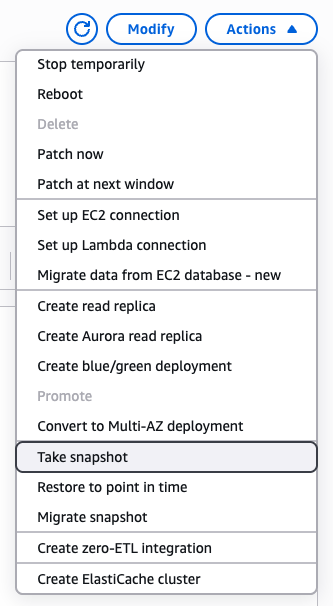
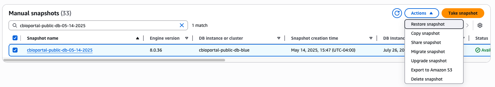
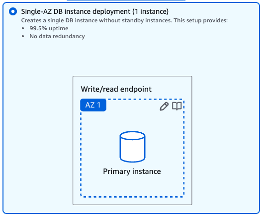
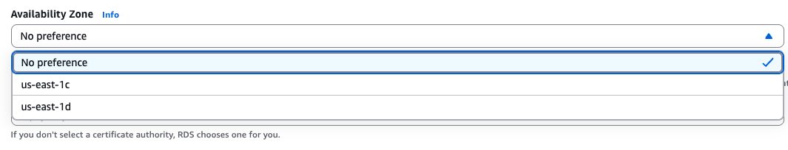
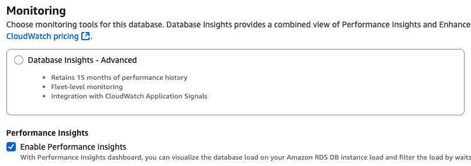

# cBioPortal Deployment with Database Migration

This guide details the steps for releasing and deploying cBioPortal alongside any required database schema migrations.

## cbioportal-core Release

### Update POM before release
1. **Update release version**  
   https://github.com/cBioPortal/cbioportal-core/blob/main/pom.xml#L12
2. **Sync database schema version**  
   Ensure the `databaseSchemaVersion` matches the version in cgds.sql in the backend repo:  
   https://github.com/cBioPortal/cbioportal-core/blob/main/pom.xml#L22
3. **Update cBioPortal model version (if needed)**  
   Adjust the `cbioportalModelVersion` property:  
   https://github.com/cBioPortal/cbioportal-core/blob/main/pom.xml#L23

### Build cbioportal-core locally
- After updating the POM, run: mvn package -DskipTests
- This produces a JAR named `core-x.y.z.jar`, which you will include in the release assets.

### Release cbioportal-core
- Create a new **pre-release** on GitHub.
- Upload `core-x.y.z.jar` as an asset.  
  
- Finish and publish the release.

## Frontend Release

Perform the frontend release following the standard procedure:  
https://docs.cbioportal.org/development/release-procedure/

## Backend Release

### Integration Tests
- Ensure all integration tests pass against the new pre-release of **cbioportal-core**.
- Address any failures before proceeding.

### LocalDB Tests
- LocalDB tests use a prepopulated MySQL image. Any database migration requires regenerating this image:
    - CI config: https://github.com/cBioPortal/cbioportal/blob/master/.circleci/config.yml#L246
    - Docker Hub: https://hub.docker.com/r/cbioportal/mysql
- Once rebuilt, run the full suite of LocalDB tests.

### Perform backend release
- Follow the official backend release procedure:  
  https://docs.cbioportal.org/development/release-procedure/

## Database Migration

1. **Identify target databases**  
   Production RDS instances: `mskdb`, `publicdb`, `geniedb`.
2. **Pause data imports**  
   Wait for any running importers to finish, then temporarily disable new importer jobs.
3. **Snapshot production databases**
    - Create an RDS snapshot of each instance.  
      
4. **Restore snapshot to staging RDS**
    - Restore each snapshot into a new RDS instance.  
      
    - Choose **Single AZ** deployment.  
      
    - Copy security groups, subnets, and tags from production.
    - Verify the same Availability Zone as importer nodes for optimal performance.  
      
    - After creation, enable Performance Insights for monitoring.  
      
5. **Apply migrations**
    - Run the migration scripts against each staging RDS instance.

## Deploy New Backend with Migrated Database

- Update application configuration to point to the new RDS endpoint.
- Deploy backend services to **staging** and validate functionality.
- Gradually roll out to lower-traffic environments, then full production.
- Once validated, update DNS records to redirect traffic to the new RDS instances.

## Cleanup

- Delete old RDS instances (note: paused RDS instances restart after 7 days).
- Confirm all deployments reference the correct DB host and backend image.
