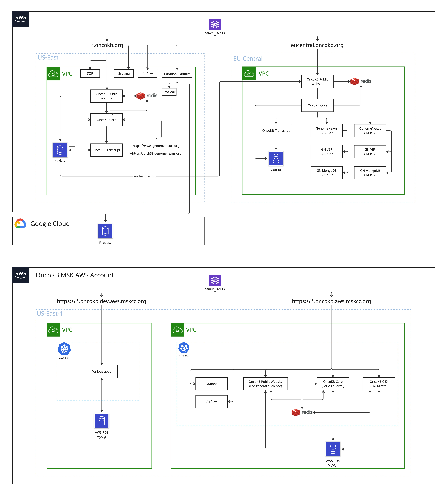

# OncoKB

All ConfigMaps and Secrets for oncokb-eu cluster are under [oncokb-deployment repo](https://github.com/knowledgesystems/oncokb-deployment/tree/master/credentails).
For all other cluster, config/secrets can be found in [portal-configuration repo](https://github.com/knowledgesystems/portal-configuration)

## System Architecture

  
Editable board is located here https://miro.com/app/board/uXjVMTJ_gKI=/

## Clusters

- **cbioportal-prod/oncokb** This is the shared account with cBioPortal which serves the OncoKB public apps that running
  behind oncokb.org. The cluster is under us-east-1.
- **oncokb-eu/default** This is a cluster served under eu-central-1 region. 
- **oncokb-dev/default** This is the MSK dev cluster. Account: msk-oncokb-dev (762447640649)
- **oncokb-production/default** This is the MSK production cluster. Account: msk-oncokb-prod (084637913395)

## Manage clusters

- All clusters are served under AWS/EKS. We use ArgoCD to sync and deploy applications.
- All clusters use the default namespace to serve apps except the cbioportal-prod which is `oncokb`.
- OncoKB cluster versions are managed by Terraform.
- We use helm(v3.5.2) to install charts.

## Services

### Redis

- We currently only use Redis Cluster in production.
- Managed by ArgoCD. Find appropriate cluster [here](/argocd/aws/)

### Airflow

- We have two versions of airflow running.
    - airflow.oncokb.org
    - airflow.oncokb.aws.mskcc.org
- The dags are located at https://github.com/oncokb/oncokb-pipeline/tree/master/oncokb-airflow/oncokb

### Prometheus/Grafana

- Managed by ArgoCD, see [HERE](/argocd/aws/203403084713/clusters/cbioportal-prod/apps/prometheus/values.yaml)

### Notes

#### Creating a new subdomain

To add a subdomain of oncokb.org, please follow the steps below:

1. Add host under spec.hosts in ingress/ingress_oncokb.yml
2. Under the same yaml file, add rule to handle traffic to the subdomain
3. Add k8s Service and Deployment under oncokb folder. The service name should be the same as the step 2. You can use
   oncokb/oncokb_public.yaml file as an example
4. Commit changes to GitHub
5. Login to ArgoCD Web and sync
