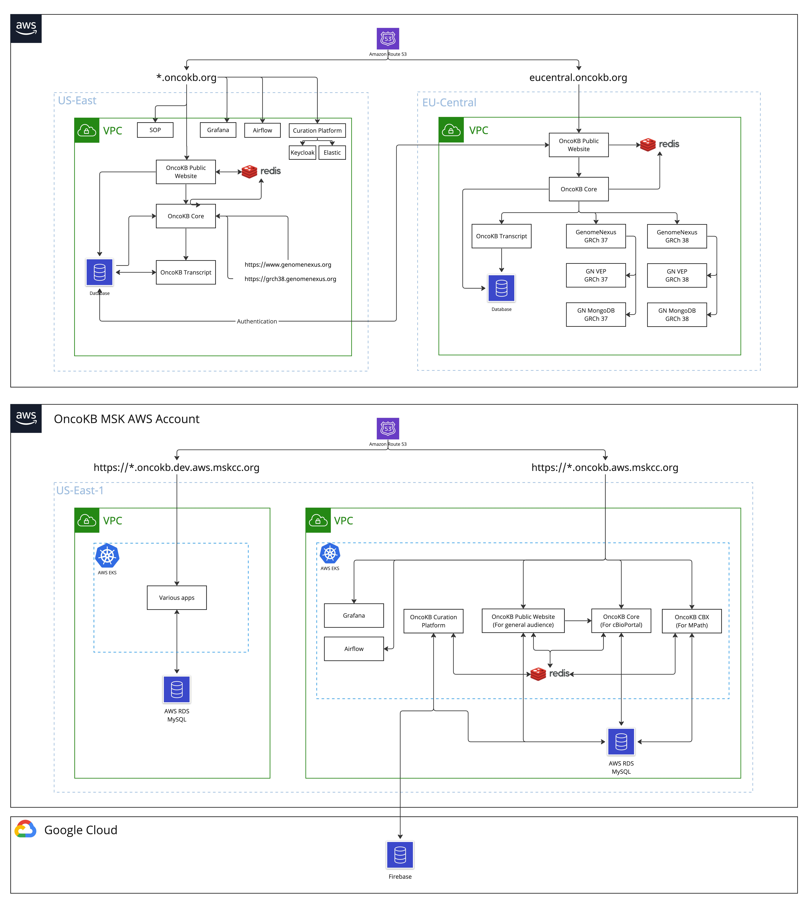

# OncoKB

Create a namespace specific to genome nexus:
```
kubectl create namespace oncokb
```

We use an external AWS MySQL db for OncoKB. Credentials are in
`portal-configuration/k8s-config-vars/oncokb/config_map.yaml`. To store the configmap in the cluster:

```bash
kubectl apply -f portal-configuration/k8s-config-vars/oncokb/config_map.yaml --namespace=oncokb
```

To deploy OncoKB once the database has been initialized (see [Init or Update AWS db](#Init-or-Update-AWS-db)):

```bash
kubectl apply -f oncokb.yaml
```

## Init or Update AWS db

From OncoKB repo run:

```bash
cat ./core/src/main/resources/spring/database/oncokb.sql | \
    mysql -h MYSQL_HOST -u MYSQL_USER  -pMYSQL_PASSWORD ONCOKB_DB
```

## Notes

- The caching on boot takes quite a while which is why we need the long livenessProbe/readinessProbe.

## OncoKB Public Redis
We currently only use Redis Cluster in production.

## Sentinel
### Install
####  With AOF persistence
```bash
helm install -f oncokb_sentinel_redis_cache_values.yaml --namespace=oncokb oncokb-sentinel-redis bitnami/redis --set auth.password=oncokb-public-redis-password
```
####  Without any persistence
```bash
helm install -f oncokb_sentinel_redis_no_persistence_cache_values.yaml --namespace=oncokb oncokb-sentinel-redis-no-persistence bitnami/redis --set auth.password=oncokb-public-redis-password
```

### Delete
```
helm del --purge oncokb-public-redis -n
```

## Cluster
### Install
```bash
helm install -n oncokb oncokb-redis-cluster -f oncokb_cluster_redis_values.yaml bitnami/redis-cluster --set password=<password>
```

### Grafana Redis Config
Name: OncoKB Sentinel Redis  
Address: redis://oncokb-sentinel-redis-headless:26379  
Master Name: oncokb-master  
Passwords are the same for Redis and Sentinel sections  

## Creating a new subdomain
To add a subdomain of oncokb.org, please follow the steps below:
1. Add host under spec.hosts in ingress/ingress_oncokb.yml
2. Under the same yaml file, add rule to handle traffic to the subdomain
3. Add k8s Service and Deployment under oncokb folder. The service name should be the same as the step 2. You can use oncokb/oncokb_public.yaml file as an example
4. Apply the Service/Deployment above by `kubectl apply -f [yaml file path you created above]`
5. Apply the modified ingress `kubectl apply -f ingress/ingress_oncokb.yml`

## System Architecture
  
Editable board is located here https://miro.com/app/board/uXjVMTJ_gKI=/
